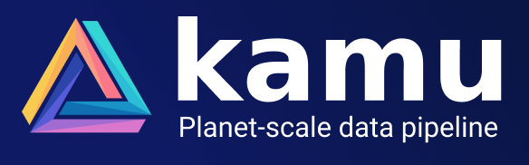

<div align="center">



<p>

[](https://github.com/kamu-data/kamu-node/releases/latest)
[](https://github.com/kamu-data/kamu-node/actions)
[](https://discord.gg/nU6TXRQNXC)

</p>
</div>

## About

Kamu Compute Node is a set of [Kubernetes](https://kubernetes.io/)-native applications that can be deployed in any cloud or on-prem to:

- Operate the stream processing pipelines for a certain set of data flows
- Continuously verify datasets that you are interested it to catch malicious behavior
- Execute queries on co-located data

Nodes are the building pieces of the [Open Data Fabric](https://docs.kamu.dev/odf/) and the primary way of contributing resources to the network. Unlike blockchain nodes that maintain a single ledger, Kamu nodes can form loosely connected clusters based on vested interests of their operators in certain data pipelines.

If you are new to ODF - we recommend you to start with [Kamu CLI](https://github.com/kamu-data/kamu-cli/) instead for a gradual introduction. You should consider Kamu Node when you want to:
- Build a horizontally-scalable data lake for your data
- Need a decentralized infrastructure for sharing data with your partners or globally without intermediaries
- Want to continuously operate ODF data pipelines or verify data


## API Server
Prerequisites:
* Install `rustup`
* Install `bunyan` crate (`cargo install bunyan`) to get human-readable log output when running services in the foreground

To run API server using local `kamu` workspace:

```bash
cargo run --bin kamu-api-server -- --repo-url workspace/.kamu/datasets run | bunyan
```

To control log verbosity use the standard `RUST_LOG` env var:

```bash
RUST_LOG="trace,mio::poll=info" cargo run ...
```

To explore GQL schema run server and open http://127.0.0.1:8080/playground.

To test GQL queries from the CLI:

```bash
cargo run --bin kamu-api-server -- gql query '{ apiVersion }' | jq
```


### API Server with Remote Repository (S3 bucket)

To use it:

```bash
cargo run --bin kamu-api-server -- --repo-url s3://example.com/kamu_repo run | bunyan
```


### GitHub Auth
To use API server for GitHub's OAuth you will need to set following environment variables:
- `KAMU_AUTH_GITHUB_CLIENT_ID` - Client ID of your GitHub OAuth app
- `KAMU_AUTH_GITHUB_CLIENT_SECRET` - Client secret of your GitHub OAuth app

Then you can use the following mutation:

```gql
mutation GithubLogin {
  auth {
    githubLogin (code: "...") {
      token {
        accessToken
        scope
        tokenType
      }
      accountInfo {
        login
        email
        name
        avatarUrl
        gravatarId
      }
    }
  }
}
```
