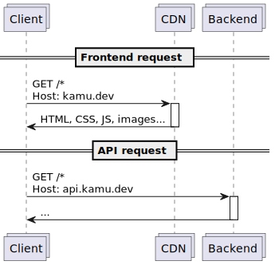
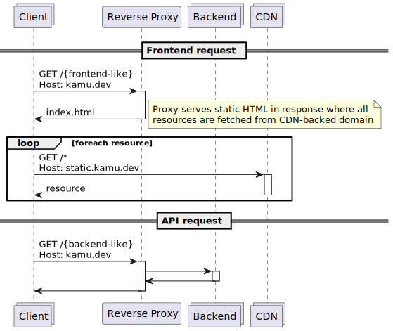
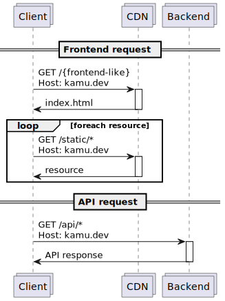
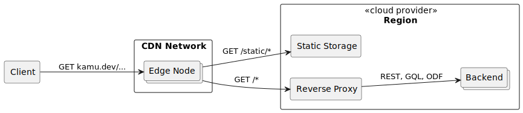
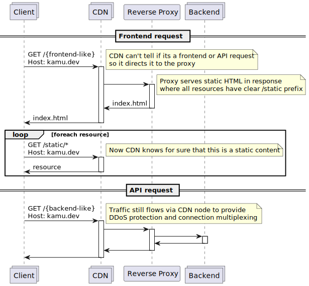

# 2. Traffic Routing

Inception Date: `2022-12-28`

Accepted Date: `2023-01-03`

## Context

We need to decide how traffic gets routed between the clients and the frontend, backend, and its wide range of API services.

### Assumptions
- Frontend is static:
  - It consists of:
    - an application bundle (JS/WASM)
    - and resources: CSS, fonts, images, videos ...
  - All these can be served as static files
- Backend is dynamic:
  - It will provide multiple APIs and serve several types of clients:
    - Frontend (via GQL)
    - Kamu API (REST / GQL) - for automation, B2B integrations
    - Data APIs (ODF, Kafka, MQTT) - data transfer, ingest, egress
    - Query APIs (SQL, REST, SPARQL, Oracle) - for querying

### Considerations
- **URL clarity**
  - Short and readable URLs are nice
  - Users should have no confusion as to which domain name to use for what
- **Latency**
  - The closer the data source is to the client the better
  - Should leverage CDNs & edge
  - Should consider impact of [CORS Preflight request](https://developer.mozilla.org/en-US/docs/Glossary/Preflight_request)
- **Multi-region**
  - We are likely to grow beyond one region
  - May need to route/restrict traffic based on geolocation/geofencing
- **Load balancing & Failover**
  - When one region is in trouble, we should be able to redirect traffic to the health one
- **Blue/Green Deployments**
  - Should be able to do smooth automated gradual rollouts and roll-backs of backend versions
- **Traffic prioritization**
  - Some traffic may be more important than the other
  - Consider what we can use to distinguish between: types of clients, tenants, etc.
- **DDoS**
  - Should consider prevention/mitigation techniques
- **On-prem**
  - Our scheme should not create complexity for on-prem installations (e.g. work via IP, and under single DNS name)
- **User-generated Content & White Labeling**
  - We may provide ability for users to create and host their own content (e.g. data hubs similar to GitHub Pages)
  - It should be possible for them to use their own domain names 
- **Cost**
  - What's the price at scale?

### Option 1: Separate frontend and backend domains

Setup:
- Frontend runs under `kamu.dev` (optionally behind a CDN)
- Backend runs under `api.kamu.dev` / `data.kamu.dev` / other aliases

- ❌ **URL clarity**
  - ODF push/pull operations will have to use the longer API domain name
    - e.g. instead of `kamu pull odf+https://kamu.dev/account/dataset`
    - will have to use `kamu pull odf+https://api.kamu.dev/account/dataset`
  - Kamu CLI needs to be aware of both the frontend (for login) and the backend (for data APIs) for every platform instance
    - This means either having users specify both or having an extra mechanism to get API address as part of the login
    - This creates extra complexity
  - On the bright side - frontend and backend get their own URL space and will never be in conflict
- ❌ **Latency**
  - CORS Preflight requests will induce extra roundtrip latency between the frontend and the backend
    - Requires correct configuration of headers to make use of CORS [preflight caching](https://developer.mozilla.org/en-US/docs/Web/HTTP/Headers/Access-Control-Max-Age)
- ✅ **Multi-region**
- ✅ **Load balancing & Failover**
- ✅ **Blue/Green Deployments**
  - Regions for frontend and backend and the flow of traffic can be controlled separately
- ✅ **Traffic prioritization**
  - API traffic is clearly distinguishable from frontend traffic
- ❌ **DDoS**
  - Requires additional measures to protect the backend
- ❌ **On-prem**
  - Frontend and backend need to be kept separate via different ports / IPs / DNS names
- ✅ **User-generated Content & White Labeling**
  - A fully orthogonal problem
- ✅ **Cost**

### Option 2: CDN-backed domain for resources

Setup:
- Frontend and backend share a single domain `kamu.dev`
- Backend (or our LB directly) serves our tiny `index.html`
- `index.html` and all resource links in the frontend application point to a domain under CDN

**Assessment**:
- ✅ **URL clarity**
  - Frontend and backend share same domain name
    - URL space is also shared though, so routing requires holistic design
  - Same dataset URL (e.g. `https://kamu.dev/account/dataset`) can be used for both viewing it on the web and for pushing/pulling via ODF protocol
    - Just like in GitHub where one URL servers web UI, and both dumb and smart Git protocols
    - This is achieved by a set of proxy rules that differentiate the traffic by URL path or request headers
- ✅❌ **Latency**
  - No CORS between frontend app and backend
  - Static resources are delivered from CDN
  - Reverse proxy (ELB) gets extra load from serving (albeit very small) initial frontend requests (`index.html`)
  - Some CORS requests may be needed when fetching resources from the CDN-backed domain, but should be cacheable
  - Establishing connection to the backend requires full roundtrips (TCP, TLS) to the application load balancer which is slower compared to connecting to a CDN edge node
- ✅ **Multi-region**
- ✅ **Load balancing & Failover**
- ✅ **Blue/Green Deployments**
  - No blockers in sight
- ✅❌ **Traffic prioritization**
  - Differentiating frontend and API requests requires more advanced URL matching
- ❌ **DDoS**
  - Requires additional measures to protect the backend
- ✅ **On-prem**
  - Entire service can be served from one address
- ✅ **User-generated Content & White Labeling**
  - A fully orthogonal problem
- ✅ **Cost**

### Option 3: Multi-origin CDN

**Setup**:
- Frontend and backend share a single domain `kamu.dev`
- Entire domain is served via CDN
- CDN is configured with two origins - for static and dynamic content
- Origin is determined by URL matching 

**Assessment**:
- ❌ **URL clarity**
  - Unlike in "Option 2" it seems hard to achieve single URL for WebUI and ODF protocol in this option
    - This is due to typical CDN routing rules being more restrictive than typical HTTP proxy rules
    - e.g. CloudFront can only route based on URL path wildcards that only support: prefix (`/api/*`), suffix (`*.jpg`), and very limited infix (`*.doc*`) routing
    - It seems not possible to express a complex rule like `/{account}/{dataset}/refs` with it
- ✅ **Latency**
  - No CORS
  - CDN delivers static resources
  - CDN can also cache dynamic content if you return correct headers
  - Clients connect faster as TLS handshakes happen at the edge nodes
  - Backend sees fewer connections as they are persistent and multiplexed via edge nodes
- ✅ **Multi-region**
- ✅ **Load balancing & Failover**
- ✅ **Blue/Green Deployments**
  - No blockers in sight
- ✅❌ **Traffic prioritization**
  - Differentiating frontend and API requests requires more advanced URL matching
- ✅ **DDoS**
  - Backend is not directly exposed to external traffic and protected by CDN
- ✅ **On-prem**
  - Entire service can be served from one address
- ❔ **User-generated Content & White Labeling**
  - TBD
- ✅❌ **Cost**
  - Routing backend traffic via CDN may be more costly than direct requests to the cloud, but it might be justified for having DDoS protection

## Decision

We will use a combination of Options 2 and 3:
- We will use a single domain name `kamu.dev` for:
  - Frontend
  - Kamu API (REST, GQL)
  - ODF Data API
- This domain will be entirely proxied by a CDN (e.g. CloudFront)
  - For frontend - speeds up static resource delivery
  - For backend - provides DDoS protection, faster TCP/TLS handshakes, and connection multiplexing
- CDN will have two routing rules:
  - `/static/*` - will point to static storage (e.g. S3)
  - `/*` - all other requests will be handed over to backends via reverse proxy
- Reverse proxy (e.g. AWS ELB/ALB)
  - Will contain a more elaborate set of rules to differentiate between frontend and backend requests, e.g.
    - `/graphql` -> Kamu GQL API worker pool
    - `/api/*` -> Kamu REST API worker pool
    - `/{account}/{dataset}/{refs|blocks|data|checkpoints|pull|push}` -> ODF data API worker pool
    - `/*` -> frontend request
  - For all frontend requests proxy will return a static response containing `index.html` of the platform Web UI
- Frontend app will be built in a way to serve all resources from `/static/*` URL prefix to leverage CDN
  - This includes JS app bundle itself and all images, CSS, fonts, etc.
- Other protocols:
  - Non-HTTP-based protocols will be hosted on their own subdomains (e.g. `kafka.kamu.dev`, `mqtt.kamu.dev`)
  - For HTTP-based protocols we should prefer to use subdomains, unless there is a clear advantage to fit them under `kamu.dev` (like in case of the ODF protocol)

## Consequences

- ✅ **URL clarity**
  - Frontend and backend share same domain name
    - URL space is also shared though, so routing requires holistic design
  - Same dataset URL (e.g. `https://kamu.dev/account/dataset`) can be used for both viewing it on the web and for pushing/pulling via ODF protocol
- ✅ **Latency**
  - No CORS
  - CDN delivers static resources
  - CDN can also cache dynamic content if you return correct headers
  - Clients connect faster as TLS handshakes happen at the edge nodes
  - Backend sees fewer connections as they are persistent and multiplexed via edge nodes
- ✅ **Multi-region**
  - CDN can route to different regions
- ✅ **Load balancing & Failover**
  - No blockers it seems, but requires further investigation of specific CDN provider to establish what failover and traffic distribution control knobs they provide on a inter-region level
- ✅ **Blue/Green Deployments**
  - Reverse proxies can flexibly direct traffic between different pools of workers allowing progressive rollouts
  - Exact technologies to use for that are deemed out of scope of this ADR
- ❔ **Traffic prioritization**
  - Requires further work - deeming out of scope of this ADR
- ✅ **DDoS**
  - Backend is not directly exposed to external traffic and protected by CDN
- ✅ **On-prem**
  - Entire service can be served from one address
- ❔ **User-generated Content & White Labeling**
  - Don't see any immediate issues that would prevent us from provisioning subdomains per user (e.g. `{account}.kamu.dev`)
  - Rest of the work deeming out of scope
- ✅ **Cost**
  - Routing backend traffic via CDN may be more costly than direct requests to the cloud, but it might be justified for having DDoS protection
  - Falling back to Option 2 is possible by changing how frontend app is packaged to serve all resources from a different domain

## References

- [InfoQ: Netflix Networking: Beating the Speed of Light with Intelligent Request Routing](https://www.infoq.com/presentations/intelligent-request-routing/)
  - Proxying API requests via CDN edge nodes
- [opensource.com: How Netflix does failovers in 7 minutes flat](https://opensource.com/article/18/4/how-netflix-does-failovers-7-minutes-flat)
- [AWS: Restricting access to Application Load Balancers](https://docs.aws.amazon.com/AmazonCloudFront/latest/DeveloperGuide/restrict-access-to-load-balancer.html)
- [AdvancedWeb: How CloudFront routing works](https://advancedweb.hu/how-cloudfront-routing-works/)
- [AdvancedWeb: How CloudFront solves CORS problem](https://advancedweb.hu/how-cloudfront-solves-cors-problems/)
- [AWS: Visitor Prioritization with CloudFront and Lambda@Edge](https://aws.amazon.com/ru/blogs/networking-and-content-delivery/visitor-prioritization-on-e-commerce-websites-with-cloudfront-and-lambdaedge/)
- [AWS: Best practices for DDoS mitigation](https://docs.aws.amazon.com/whitepapers/latest/aws-best-practices-ddos-resiliency/best-practices-for-ddos-mitigation.html)
- [AWS: Protecting dynamic web apps against DDoS with CloudFront and Route53](https://aws.amazon.com/blogs/security/how-to-protect-dynamic-web-applications-against-ddos-attacks-by-using-amazon-cloudfront-and-amazon-route-53/)
- [AWS: Creating a multi-region application](https://aws.amazon.com/ru/blogs/architecture/creating-a-multi-region-application-with-aws-services-part-1-compute-and-security/)